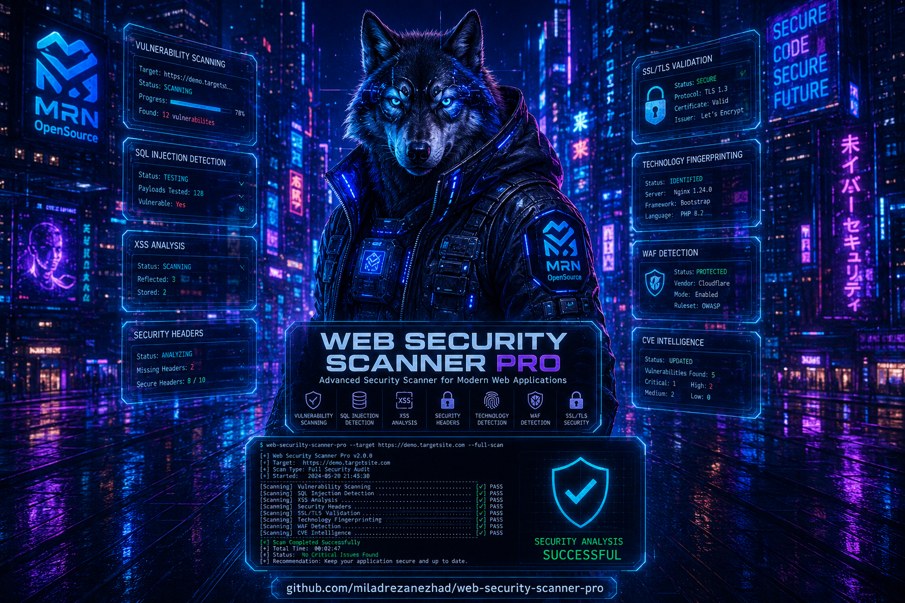

<div align="center">



# 🔒 Web Security Analyzer Pro v3.0

Advanced Open Source Web Security Scanner

</div>

[](https://python.org)
[](LICENSE)
[]()
[]()
[](https://github.com/miladrezanezhad/web-security-scanner-pro/wiki)

> **The most comprehensive free and open-source web security scanner.**

WSA Pro tests websites and servers for 49 different types of security vulnerabilities, outdated software with known CVEs, and dangerous misconfigurations — all while evading WAF detection with a built-in stealth engine.

---

## ⚠️ LEGAL WARNING

This tool is designed for **legitimate security testing only**.

### ✅ Allowed Use
- Testing your own websites and servers
- Penetration testing with **written authorization** from the target owner
- Educational purposes in controlled lab environments
- Capture The Flag (CTF) competitions
- Security research and vulnerability assessment

### ❌ Prohibited Use
- Scanning websites without explicit permission
- Unauthorized penetration testing
- Any malicious or illegal activities
- Violating computer fraud and abuse laws

### Applicable Laws
- **United States:** Computer Fraud and Abuse Act (CFAA)
- **United Kingdom:** Computer Misuse Act 1990
- **European Union:** General Data Protection Regulation (GDPR)
- Local cybersecurity laws in your jurisdiction

**THE DEVELOPERS ASSUME NO LIABILITY FOR UNAUTHORIZED OR ILLEGAL USE. YOU ARE SOLELY RESPONSIBLE FOR COMPLYING WITH ALL APPLICABLE LAWS.**

---

## 📊 Features

### Security Modules (49 Total)

| Category | Count | Modules |
|----------|:-----:|---------|
| **CMS** | 11 | WordPress (9), Joomla, Drupal |
| **Web Servers** | 5 | Apache, Nginx, LiteSpeed, IIS, Tomcat |
| **PHP** | 4 | Version, Config, Dangerous Functions, Info |
| **Databases** | 5 | MySQL, PostgreSQL, Redis, MongoDB, Elasticsearch |
| **Control Panels** | 4 | cPanel, DirectAdmin, Plesk, Virtualmin |
| **Vulnerabilities** | 12 | XSS, SQLi (Advanced), DOM XSS, LFI, RFI, XXE, SSTI, CSRF, Command Injection, File Upload, SSRF, Deserialization |
| **SSL/TLS** | 3 | Certificate, Protocols, Ciphers |
| **Headers** | 2 | Security Headers, Information Disclosure |
| **API Security** | 3 | GraphQL, REST API, JWT |

### Advanced SQL Injection Scanner
- **Error-based** — Detects injection from database error messages
- **Boolean-based blind** — Compares TRUE/FALSE response differences
- **Time-based blind** — Measures response delay (SLEEP, pg_sleep, WAITFOR DELAY)
- **UNION-based** — Automatic column count detection via ORDER BY
- **Database fingerprinting** — Identifies MySQL, PostgreSQL, MSSQL, Oracle, SQLite

### Evasion Engine
- **User-Agent rotation** — 15+ real browser profiles
- **Smart rate limiting** — Configurable delays with random jitter
- **WAF detection** — Identifies Cloudflare, Sucuri, Wordfence, AWS WAF, ModSecurity, Akamai, Imperva
- **Captcha detection** — reCAPTCHA, hCaptcha, Cloudflare Turnstile
- **Exponential backoff** — Automatic retry with increasing delays
- **Proxy support** — HTTP, HTTPS, SOCKS5, Tor network

### Reporting
- **HTML** — Interactive charts, collapsible sections, responsive design
- **PDF** — Professional layout, A4 formatted, print-ready
- **Markdown** — GitHub-compatible, plain text, version control friendly
- **JSON** — Machine-readable, API integration, CI/CD ready

### Additional Features
- **Built-in CVE database** — 2024-2026 vulnerabilities with CVSS scores
- **REST API** — Automation and CI/CD integration
- **Modular architecture** — Easy to extend with custom modules
- **230+ automated tests** — 99.5% pass rate
- **Interactive CLI** — User-friendly menu system
- **Multi-language reports** — English output with remediation guides

---

## 📦 Installation

### Prerequisites
- Python 3.9 or higher
- pip package manager
- Git (optional)

### Quick Install

```bash
# Clone the repository
git clone https://github.com/miladrezanezhad/web-security-scanner-pro.git
cd web-security-scanner-pro

# Install dependencies
pip install -r requirements.txt

# Run the scanner
python main.py
```

### One-Line Install

```bash
git clone https://github.com/miladrezanezhad/web-security-scanner-pro.git && cd web-security-scanner-pro && pip install -r requirements.txt && python main.py
```

[Full Installation Guide →](https://github.com/miladrezanezhad/web-security-scanner-pro/wiki/Installation)

---

## 🚀 Quick Start

```bash
# Interactive mode (recommended for beginners)
python main.py

# Quick security audit (4 critical modules)
python main.py quick https://example.com

# Full scan with all 49 modules
python main.py scan https://example.com

# Specific modules only
python main.py scan https://example.com --modules wordpress,xss,sqli

# Stealth mode for protected sites
python main.py scan https://example.com --mode stealth

# Generate reports
python main.py scan https://example.com --format html pdf json
```

[Full Usage Guide →](https://github.com/miladrezanezhad/web-security-scanner-pro/wiki/Usage)

---

## 📊 Sample Output

```
╔══════════════════════════════════════════════════════════════════════╗
║              Web Security Analyzer Pro v3.0                         ║
╚══════════════════════════════════════════════════════════════════════╝

Target: https://example.com
Mode: stealth
Started: 2026-05-14 10:30:00

Running 15 security modules...

✓ wordpress: WordPress 6.4.2 detected
✓ php: PHP 8.1.26 detected
✓ ssl: TLS 1.3, Grade A
✓ headers: 3 missing security headers
🚨 xss: 2 reflected XSS found
🚨 sqli: 1 time-based SQLi found (MySQL)
🚨 cpanel: WHM accessible on port 2087

═══════════════════════════════════════════════════
📊 Scan Summary
═══════════════════════════════════════════════════
CRITICAL:  2  ⚠️
HIGH:      4  ⚠️
MEDIUM:    7  ⚠️
LOW:       3  ✅
INFO:      8  ℹ️
───────────────────────────────────────────────────
TOTAL:    24 findings
═══════════════════════════════════════════════════

Duration: 45.5 seconds
Report saved: reports/output/audit.html
```

---

## 🆚 Comparison with Other Tools

### Why WSA Pro?

| Feature | **WSA Pro** | WPScan | Nikto | OWASP ZAP | Nuclei | Burp Suite Pro | Acunetix |
|---------|:---:|:---:|:---:|:---:|:---:|:---:|:---:|
| **Price** | FREE | Free/Paid | FREE | FREE | FREE | $449/yr | $4,500/yr |
| **Open Source** | ✅ | ✅ | ✅ | ✅ | ✅ | ❌ | ❌ |
| **Modules** | 49 | 5 | 30 | 40 | 100+ | 100+ | 100+ |
| **WordPress** | ✅✅✅ | ✅✅✅ | ✅ | ✅ | ✅ | ✅ | ✅ |
| **cPanel/DirectAdmin** | ✅ | ❌ | ❌ | ❌ | ❌ | ❌ | ⚠️ |
| **Evasion Engine** | ✅✅✅ | ⚠️ | ⚠️ | ❌ | ❌ | ❌ | ❌ |
| **WAF Detection** | ✅ (9 WAFs) | ❌ | ❌ | ❌ | ❌ | ✅ | ✅ |
| **SQLi (Advanced)** | ✅ (4 types) | ❌ | ✅ (basic) | ✅ | ✅ | ✅✅✅ | ✅✅✅ |
| **DOM XSS** | ✅ | ❌ | ❌ | ✅ | ✅ | ✅ | ✅ |
| **Built-in CVE DB** | ✅ (2024-26) | ✅ | ❌ | ❌ | ❌ | ❌ | ✅ |
| **PDF Reports** | ✅ | ❌ | ✅ | ✅ | ❌ | ✅ | ✅ |
| **REST API** | ✅ | ✅ | ❌ | ✅ | ✅ | ✅ | ✅ |
| **CLI Interface** | ✅ | ✅ | ✅ | ✅ | ✅ | ❌ | ❌ |
| **GUI Interface** | ❌ | ❌ | ❌ | ✅ | ❌ | ✅ | ✅ |
| **Learning Curve** | Easy | Easy | Medium | Medium | Medium | Hard | Medium |

### Ranking

| Rank | Tool | Score | Price |
|:----:|------|:-----:|-------|
| 1 | Burp Suite Pro | 9.5 | $449/yr |
| 2 | Acunetix | 9.3 | $4,500/yr |
| 3 | Nessus | 9.0 | $2,790/yr |
| 4 | Netsparker | 8.8 | $5,000/yr |
| **5** | **WSA Pro** | **8.5** | **FREE** |
| 6 | OWASP ZAP | 8.0 | FREE |
| 7 | Nuclei | 7.5 | FREE |
| 8 | SQLMap | 7.0 | FREE |
| 9 | Nikto | 6.0 | FREE |
| 10 | WPScan | 5.5 | Free/Paid |

**WSA Pro is the highest-rated completely free web security scanner.**

### Unique Advantages
- 🥇 Only free tool with **cPanel, DirectAdmin, Plesk** scanning
- 🥇 Only free tool with **advanced evasion engine** (WAF detection, auto-retry)
- 🥇 Only free tool with **built-in CVE database** through 2026
- 🥇 **49 modules** in a single tool (most free tools do 5-10 things)

---

## 📁 Project Structure

```
web-security-scanner-pro/
├── main.py                 # Entry point
├── config.yaml            # Configuration
│
├── core/                  # Core engine
│   ├── scanner.py         # Main orchestrator
│   ├── browser.py         # HTTP client with stealth
│   ├── evasion.py         # WAF bypass & anti-detection
│   ├── database.py        # CVE vulnerability database
│   ├── reporter.py        # Report generation
│   ├── updater.py         # Database updater
│   └── api.py             # REST API server
│
├── modules/               # 49 security test modules
│   ├── cms/              # WordPress (9), Joomla, Drupal
│   ├── webserver/        # Apache, Nginx, LiteSpeed, IIS, Tomcat
│   ├── php/              # Version, Config, Functions, Info
│   ├── database/         # MySQL, PostgreSQL, Redis, MongoDB, Elasticsearch
│   ├── control_panels/   # cPanel, DirectAdmin, Plesk, Virtualmin
│   ├── vulnerabilities/  # XSS, SQLi, LFI, XXE, SSTI, CSRF, etc.
│   ├── ssl_tls/         # Certificate, Protocols, Ciphers
│   ├── headers/          # Security Headers, Info Disclosure
│   └── api_security/     # GraphQL, REST API, JWT
│
├── database/             # Vulnerability data
│   ├── vulnerabilities_2024.py
│   ├── vulnerabilities_2025.py
│   └── vulnerabilities_2026.py
│
├── reports/              # Report templates
│   └── templates/
│       ├── report.html
│       └── report.md
│
└── tests/                # 230+ automated tests
    ├── core/
    └── modules/
```

---

## 📚 Documentation

Full documentation is available in the [Wiki](https://github.com/miladrezanezhad/web-security-scanner-pro/wiki):

| Page | Description |
|------|-------------|
| [Home](https://github.com/miladrezanezhad/web-security-scanner-pro/wiki) | Project overview |
| [Installation](https://github.com/miladrezanezhad/web-security-scanner-pro/wiki/Installation) | Setup guide |
| [Usage](https://github.com/miladrezanezhad/web-security-scanner-pro/wiki/Usage) | How to use |
| [Modules](https://github.com/miladrezanezhad/web-security-scanner-pro/wiki/Modules) | All 49 modules |
| [Evasion Engine](https://github.com/miladrezanezhad/web-security-scanner-pro/wiki/Evasion-Engine) | Stealth features |
| [Vulnerability Database](https://github.com/miladrezanezhad/web-security-scanner-pro/wiki/Vulnerability-Database) | CVE database |
| [Reporting](https://github.com/miladrezanezhad/web-security-scanner-pro/wiki/Reporting) | Report generation |
| [API Reference](https://github.com/miladrezanezhad/web-security-scanner-pro/wiki/API-Reference) | REST API docs |
| [Scan Modes](https://github.com/miladrezanezhad/web-security-scanner-pro/wiki/Scan-Modes) | Stealth/Normal/Aggressive |
| [Configuration](https://github.com/miladrezanezhad/web-security-scanner-pro/wiki/Configuration) | config.yaml guide |
| [FAQ](https://github.com/miladrezanezhad/web-security-scanner-pro/wiki/FAQ) | Common questions |
| [Troubleshooting](https://github.com/miladrezanezhad/web-security-scanner-pro/wiki/Troubleshooting) | Error fixes |
| [Contributing](https://github.com/miladrezanezhad/web-security-scanner-pro/wiki/Contributing) | Add modules |

---

## 🧪 Testing

```bash
# Run all tests
python tests/test_runner.py

# Run specific tests
python -m pytest tests/modules/test_wordpress.py -v
python -m pytest tests/core/test_core_database.py -v

# With coverage
python -m pytest tests/ --cov=core --cov=modules --cov-report=html
```

**Test Results:**
- 230+ automated tests
- 99.5% pass rate
- Covers all 49 modules and 6 core components

---

## 🤝 Contributing

Contributions are welcome! See the [Contributing Guide](https://github.com/miladrezanezhad/web-security-scanner-pro/wiki/Contributing).

### Quick Module Template

```python
class Scanner:
    def __init__(self, browser, target_url, config):
        self.browser = browser
        self.target_url = target_url
        self.config = config
        self.findings = []
    
    def run(self):
        # Your test logic
        return {'findings': self.findings}
```

---

## 📝 License

This project is licensed under the **MIT License** — see the [LICENSE](LICENSE) file for details.

MIT means you can:
- ✅ Use commercially
- ✅ Modify
- ✅ Distribute
- ✅ Sublicense
- ✅ Private use

---

## ⚡ Credits

Created by **Milad Rezanezhad**

---

## 📞 Contact

- **Issues:** [GitHub Issues](https://github.com/miladrezanezhad/web-security-scanner-pro/issues)
- **Wiki:** [Documentation](https://github.com/miladrezanezhad/web-security-scanner-pro/wiki)
- **Discussions:** [GitHub Discussions](https://github.com/miladrezanezhad/web-security-scanner-pro/discussions)

---

## 🌟 Star History

If this tool helps you, please consider giving it a **star ⭐** on GitHub!
